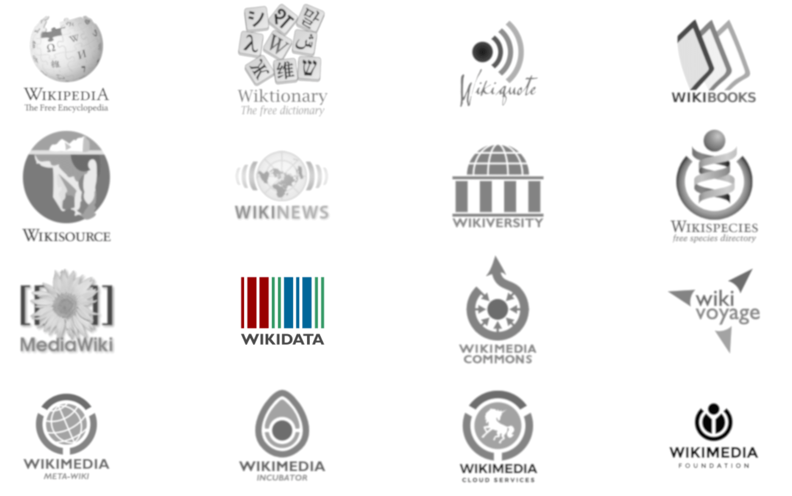

# Introduction: What is Wikidata?

<!-- see 
<https://www.wikidata.org/wiki/Wikidata:Planning_a_Wikidata_workshop>
for inspiration -->

## Wikipedia?

* Remember life before Wikipedia?

* *"An encyclopedia that anyone can edit"*

## Wikimedia

{width=80%}

## Wikidata 

* knowledge base

* it's a wiki

* community model

## Motivation

* link Wikipedia language editions

* reuse statements across Wikipedia projects

* provide complex query capabilities

*It's awesome, especially if you're into data!*

# Overview: Structure of Wikidata 

## Statements

Factual claims are stored as statements

subject -- predicate -- object

thing -- relationship -- thing

**item -- property -- value**

Similar to RDF (and mapped to its model)

## Entities

Independent of language (identifiers vs. names)

* entities, labels, descriptions, statements

* types of entities

    * items (have wiki-links)
    * properties (have data types and constraint statements)
    * lexemes

## Wakeup task

*Find item of your home town, school...*

* Statement details

    * properties
    * qualifiers
    * references

## More information

<http://bit.ly/wikidata-onepage>

<https://www.wikidata.org/wiki/Wikidata:In_one_page>

## Wikidata and identifiers

* A hub in the linked open data web

* Wikidata properties for identifiers

* One possible overview:\
  <https://www.wikidata.org/wiki/Wikidata:Identifiers>

* Example: <https://tools.wmflabs.org/sqid/#/view?id=Q18618629>

# Action: Editing Wikidata

## Task 1: Try out!

In groups of 2-3:

* add/extend Wikidata items on some of your professors

* see existing professor items as boilerplates

* collect questions for afterwards

# Magic: Using Wikidata

## Case study: Astrolabes explorer

* <http://glam-discovery.bodleian.ox.ac.uk/astrolabes/>

## Case study: WikiCite and Scholia

* <http://wikicite.org>

* <https://tools.wmflabs.org/scholia/>

## Wikidata Query Service

* <https://query.wikidata.org/>

## More Tools

* <https://tools.wmflabs.org/hay/directory/#/keyword/wikidata>

* Example: <https://tools.wmflabs.org/mix-n-match/>

# Outlook: What comes next?

## Wikimedia Commons

* more than 55 million **media files**

* **not as shiny** as Instagram, YouTube, Flickr...

* but **Open Content**, no commercial interest!

* **community** model

* quite "unstructured" 

## Structured Data on Wikimedia Commons 

Migration of Wikimedia Commons to Wikibase (2017-2019)

* every media file is an *entity*

    * multilingual media file captions
    * statements about media files

* properties reused from Wikidata, e.g. depicts (P180)

* work in progress (e.g. no SPARQL yet)

More information at 
<https://commons.wikimedia.org/wiki/Commons:Structured_data>

## Lexicographical data

Intoduction of three new types of entities in 2018:

* Lexemes (L)
* Forms (F)
* Senses (S)

<https://www.wikidata.org/wiki/Wikidata:Lexicographical_data>

Sample application: <http://auregann.fr/derdiedas/>

# Summary: What to know about Wikidata

## Know the basic structure of Wikidata

* entities, labels, descriptions, statements

    * items (have wiki-links)
    * properties (have data types and constraint statements)
    * lexemes

* statements

    * property
    * qualifiers
    * references

## Know how to query Wikidata

* Wikidata query service (SPARQL)

* Several tools and programming libraries

* (big) data dumps

## Know the limits

* Coverage is very inconsistent

* Data modeling is instable

* Qualifiers and references help to improve quality
    * but not used as much
    * harder to query

* Working with Wikidata is like doing data science:\
  cleaning data & fighting with software

## Know that it's a community

* People are not paid

* Nobody has a full overview

* Tools (plenty!) come and go

* Be nice and allow misunderstandings

